<div align="center">


<p>
  <a href="https://transitops-odoo-hackathon-xi.vercel.app"></a>
  
  
  
</p>

<p>
  
  
  
  
  
  
  
  
  
  
  
</p>

<br/>

> ### Other teams digitize the logbook. We built a fleet that runs itself.
> A cinematic, real-time command center where vehicles, drivers, dispatch, maintenance and cost live in one place, and every operational decision is protected by a strict, server-side rule engine.

<br/>

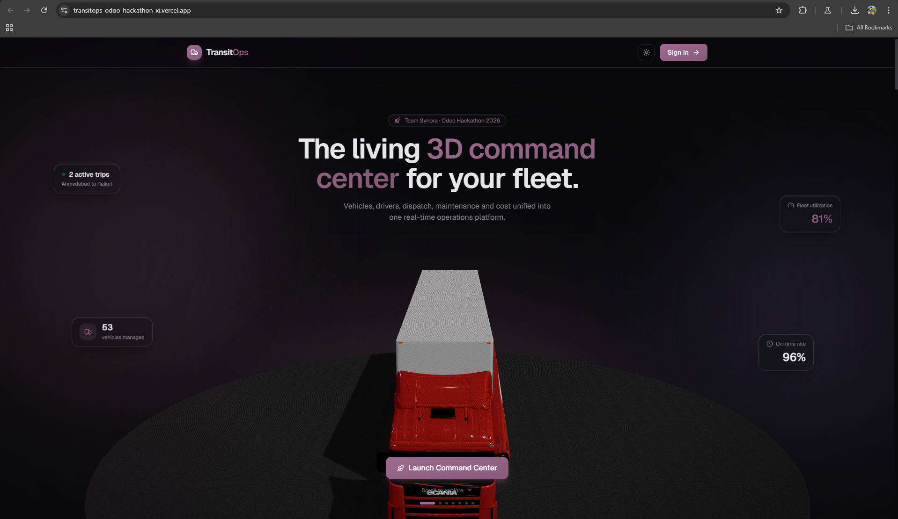

</div>

---

## Table of Contents

- [The Problem](#the-problem)
- [What We Built](#what-we-built)
- [Live Demo](#live-demo)
- [A Guided Tour](#a-guided-tour)
- [Ten Business Rules, Zero Exceptions](#ten-business-rules-zero-exceptions)
- [Smart Dispatch](#smart-dispatch)
- [Feature Highlights](#feature-highlights)
- [Architecture](#architecture)
- [Tech Stack](#tech-stack)
- [Data Model](#data-model)
- [Roles and Access](#roles-and-access)
- [Getting Started](#getting-started)
- [Deployment](#deployment)
- [Project Structure](#project-structure)
- [Team Synora](#team-synora)

---

## The Problem

A transport operation runs on three questions, all day, every day:

- **What should move, on which truck, with which driver?**
- **Is that assignment even legal and safe** (licence valid, capacity respected, vehicle roadworthy)?
- **Where is everything right now, and what is it costing us?**

Most fleet software answers these with a digital logbook: forms that record what a human already decided. The intelligence, the guardrails and the live picture stay in someone's head, a spreadsheet, and a WhatsApp group.

**TransitOps replaces all of that with a single operational command center** that recommends the optimal dispatch, refuses to let the fleet enter an invalid state, and shows every trip moving on a real map in real time.

---

## What We Built

A complete, deployed, full-stack platform covering the entire transport lifecycle:

```
Register  ->  Dispatch  ->  Track  ->  Maintain  ->  Cost & Analyze
 fleet &      smart,        live 3D     predictive     ROI, fuel,
 drivers      rule-checked  map         service        CO2, exports
```

- A **cinematic 3D landing page** that tells the product story as you scroll.
- A **role-based command center** for four operational roles.
- A **trip state machine** with all ten mandatory business rules enforced on the server.
- **Smart Dispatch**: an explainable recommender for the optimal vehicle and driver.
- A **live 3D vehicle map** where trucks drive along real road routes in real time.
- **Predictive maintenance** and a **licence compliance radar**.
- **ROI, fuel-efficiency and cost analytics** with one-click CSV and PDF export.
- Field tools: **voice trip completion** and **fuel-receipt OCR**, both fully in-browser.
- A premium **light and dark theme** in the official Odoo purple.

---

## Live Demo

**[transitops-odoo-hackathon-xi.vercel.app](https://transitops-odoo-hackathon-xi.vercel.app)**

Sign in instantly with any demo role (one click on the login screen). Password for all accounts: `synora123`

| Role | Email | Owns |
|------|-------|------|
| Fleet Manager | `fleet@synora.in` | Vehicles, maintenance, lifecycle |
| Dispatcher | `dispatch@synora.in` | Trips, vehicle and driver assignment |
| Safety Officer | `safety@synora.in` | Licences, compliance, safety scores |
| Financial Analyst | `finance@synora.in` | Fuel, cost and profitability |

<p align="center">
  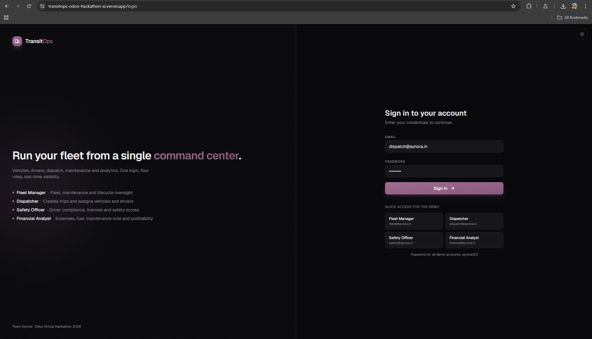
</p>

---

## A Guided Tour

### The cinematic landing

A scroll-driven story: the hero truck stays locked at center while the camera orbits it through each capability chapter (Dispatch, Live Tracking, Maintenance, Fuel, Analytics, Compliance). Floating glass HUD chips, an aurora-lit stage, and a full light and dark theme.

<p align="center">
  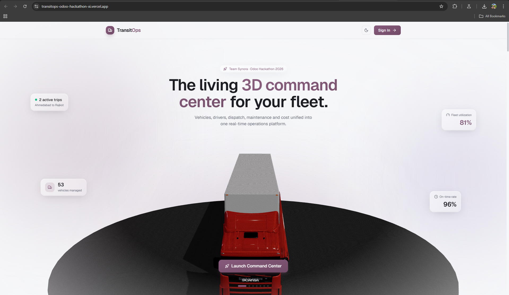
  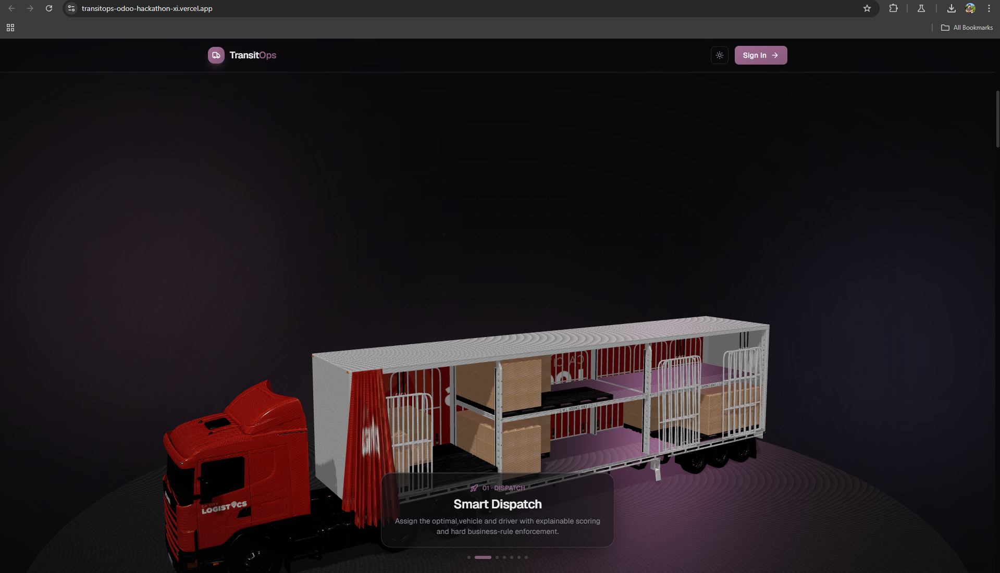
</p>

### Mission-control dashboard

Seven live KPIs that count up on load, recent trips, a vehicle-status breakdown, and two things a logbook never gives you: a **licence compliance radar** (expiry countdown) and **predictive maintenance** (service-due-in-N-km). The whole view polls live, and the entire app flips between a premium light and dark theme.

<p align="center">
  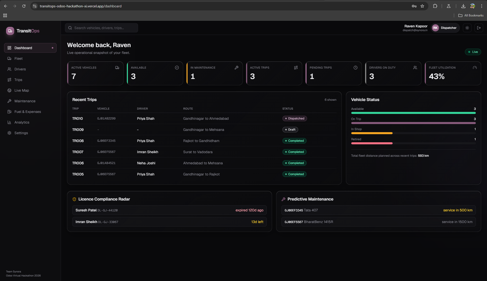
  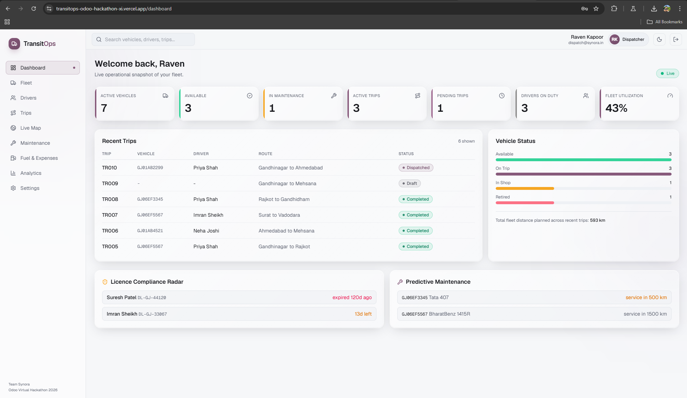
</p>

### Live 3D vehicle map

Every dispatched trip renders as a real 3D vehicle moving along its **actual road route** (fetched from OSRM, not a straight line), headlights pointed toward the destination, with departure and destination pins. Click any truck to inspect its trip. Play and speed controls, fullscreen, and a theme-aware basemap.

<p align="center">
  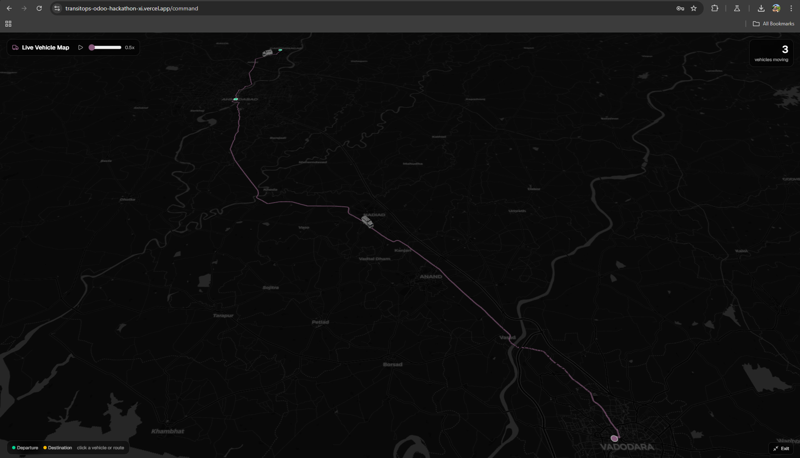
</p>
<p align="center">
  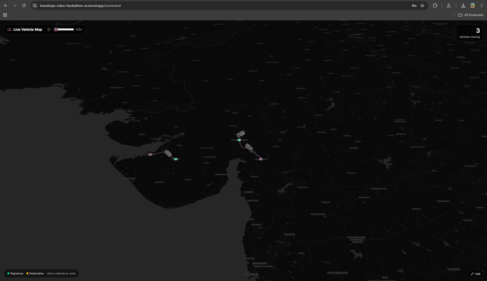
</p>

### Interactive 3D fleet yard

The vehicle registry is not just a table. Every real vehicle is rendered as a 3D model on a status-colored glow disc (green available, purple on-trip, amber in-shop, red retired). Drag to orbit, scroll to zoom. If the browser cannot open a WebGL context, it degrades gracefully to a clean 2D grid.

<p align="center">
  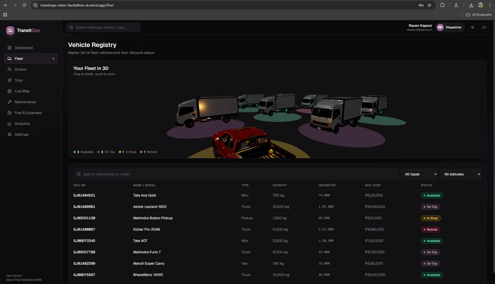
  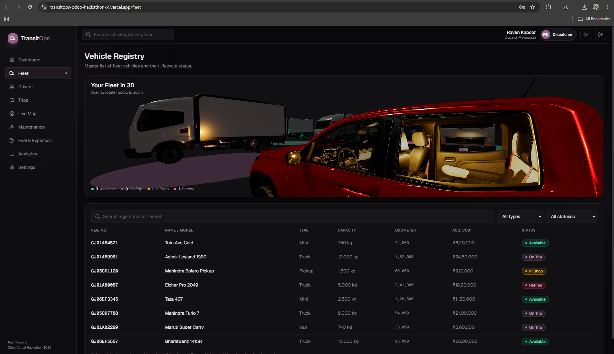
</p>

### ROI and cost analytics

Fuel efficiency, utilization, operational cost and average vehicle ROI up top; revenue by trip and a costliest-vehicles breakdown; a full vehicle ROI leaderboard; and fleet carbon footprint. Export the whole report as **CSV or a formatted PDF** in one click.

<p align="center">
  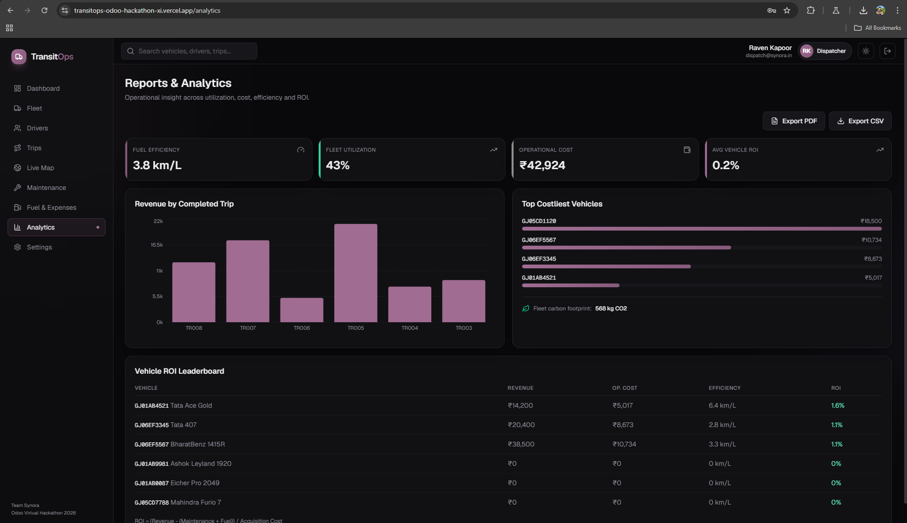
</p>

---

## Ten Business Rules, Zero Exceptions

This is what separates a command center from a logbook. Every transition runs through a single server-side state machine (`lib/services/fleet.ts`), so the fleet **cannot** enter an invalid state, no matter what the UI does.

| # | Rule | Enforced |
|---|------|----------|
| 1 | Registration numbers are unique | On create and update |
| 2 | Retired or In-Shop vehicles are hidden from dispatch | Dispatch candidate query |
| 3 | Drivers with an expired licence cannot be assigned | Dispatch validation |
| 4 | Suspended drivers cannot be assigned | Dispatch validation |
| 5 | A vehicle or driver already On Trip cannot be double-booked | Dispatch validation |
| 6 | Cargo weight can never exceed vehicle capacity | Dispatch validation |
| 7 | Dispatching a trip sets vehicle and driver to On Trip | Automatic transition |
| 8 | Completing a trip restores both to Available | Automatic transition |
| 9 | Cancelling a trip restores both to Available | Automatic transition |
| 10 | Opening maintenance moves a vehicle to In Shop (closing returns it, unless Retired) | Automatic transition |

Every rejection returns a human-readable reason, surfaced in the UI as a toast, so an operator always knows **why** an action was blocked.

---

## Smart Dispatch

Instead of picking a truck by hand, the Dispatcher asks TransitOps for the optimal assignment. The recommender (`lib/services/smart-dispatch.ts`) is **deterministic and explainable**, not a black box, and it only ever proposes assignments that already pass all ten rules.

Each candidate vehicle-and-driver pairing is scored on:

| Factor | What it optimizes |
|--------|-------------------|
| Capacity fit | The right-sized vehicle for the cargo, no waste |
| Cost per kilometer | The most economical vehicle for the route |
| Service proximity | Avoids vehicles close to their maintenance interval |
| Driver safety score | Prefers safer, compliant drivers |
| Fair workload | Spreads trips across the fleet and roster |

The top recommendation is presented with its reasoning, and the Dispatcher stays in control: accept it, or override with full context.

---

## Feature Highlights

| Feature | What it does |
|---------|-------------|
| **Cinematic landing** | Scroll-driven 3D hero truck, camera orbits per capability, glass HUD, light and dark |
| **RBAC command center** | Four roles, each scoped to exactly the tools and data they need |
| **Trip state machine** | Draft, Dispatched, Completed, Cancelled with automatic, rule-checked transitions |
| **Smart Dispatch** | Explainable optimal vehicle and driver recommendation |
| **Live 3D map** | Real road-following routes, moving 3D trucks, click to inspect, play and speed, fullscreen |
| **3D fleet yard** | One model per vehicle on a status-colored disc, with a 2D fallback |
| **Compliance radar** | Continuous licence-expiry countdown and alerts |
| **Predictive maintenance** | Service-due forecasting per vehicle by odometer interval |
| **Analytics** | Utilization, fuel efficiency, operational cost, vehicle ROI, CO2, CSV and PDF export |
| **Voice completion** | Complete a trip by speaking odometer and fuel (Web Speech API) |
| **Receipt OCR** | Snap a fuel receipt, extract litres and amount in-browser (Tesseract.js) |
| **Premium theming** | Official Odoo purple, liquid-glass surfaces, working light and dark toggle |

---

## Architecture

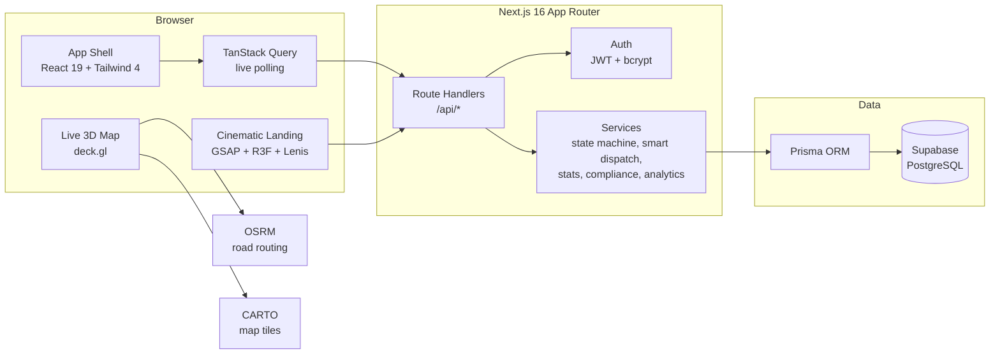

- **One codebase**, Next.js App Router, server route handlers plus React client components.
- **All rules live server-side** in a single service layer, so the API is the source of truth.
- **Live updates** via TanStack Query polling with `keepPreviousData` (smooth, no flicker), plus client-side animation for the map.
- **Deployed on Vercel**, database on **Supabase Postgres** via the connection pooler.

---

## Tech Stack

<table>
<tr>
<td valign="top" width="50%">

### Application
| Layer | Technology |
|-------|-----------|
| Framework | Next.js 16 (App Router) |
| UI | React 19 + TypeScript 5 |
| Styling | Tailwind CSS 4 (CSS-first tokens) |
| State | Zustand + TanStack Query |
| Auth | JWT (jose) + bcrypt, httpOnly cookie |
| ORM | Prisma 6 |
| Database | PostgreSQL (Supabase) |
| Hosting | Vercel |

</td>
<td valign="top" width="50%">

### Experience
| Layer | Technology |
|-------|-----------|
| 3D scenes | React Three Fiber + drei + three |
| Live map | deck.gl (Tile, Path, Scatterplot, Scenegraph) |
| Routing | OSRM public API |
| Map tiles | CARTO raster (theme-aware) |
| Motion | GSAP + ScrollTrigger + Lenis |
| Charts | Recharts |
| Voice | Web Speech API |
| OCR / PDF | Tesseract.js / jsPDF |

</td>
</tr>
</table>

---

## Data Model

Eight Prisma models capture the full operation. Status, role and type fields are validated strings (kept portable across databases), and small lists are stored as JSON.

- **User** - email, password hash, name, role.
- **Vehicle** - regNo (unique), type, capacity, odometer, acquisition cost, status, region, service interval.
- **Driver** - name, licence number, category, licence expiry, safety score, status.
- **Trip** - source, destination, vehicle, driver, cargo, planned distance, revenue, coordinates, route, lifecycle timestamps.
- **MaintenanceLog** - vehicle, type, cost, priority, open/closed.
- **FuelLog** - vehicle, trip, litres, cost, odometer, efficiency, anomaly flag.
- **Expense** - vehicle or trip, type (toll, maintenance, other), amount.
- **ActivityLog** - audit trail of who did what.

**Key formulas.** Fleet Utilization = onTrip / (available + onTrip + inShop). Fuel Efficiency = km / litre. Operational Cost = fuel + maintenance + expenses. **ROI = (Revenue - (Maintenance + Fuel)) / Acquisition Cost.** CO2 = litres x 2.68.

---

## Roles and Access

Role-based access control is enforced on every route. Each role sees a focused view; the sidebar, pages and API all respect the same permission matrix (`lib/constants.ts`).

| Section | Fleet Manager | Dispatcher | Safety Officer | Financial Analyst |
|---------|:---:|:---:|:---:|:---:|
| Dashboard | Full | Full | Full | Full |
| Fleet | Full | View | View | View |
| Drivers | View | Full | Full | View |
| Trips | Full | Full | View | View |
| Maintenance | Full | View | View | View |
| Fuel and Cost | View | View | View | Full |
| Analytics | View | View | View | Full |

---

## Getting Started

### Prerequisites
- Node.js 20+
- A PostgreSQL database (a free [Supabase](https://supabase.com) project works perfectly)

### Setup

```bash
git clone https://github.com/atharva-awade/Team-Synora-Odoo-Virtual-Hackathon.git
cd Team-Synora-Odoo-Virtual-Hackathon

npm install

# Configure environment
cp .env.example .env
# Set DATABASE_URL and DIRECT_URL to your Postgres connection strings,
# and JWT_SECRET to any long random string.

# Create the tables and load the demo fleet
npx prisma db push
npm run seed

npm run dev
```

Open `http://localhost:3000` and sign in with a demo role (password `synora123`).

> **Note on the connection string.** For Supabase, use the transaction pooler (port 6543, `?pgbouncer=true`) as `DATABASE_URL` and the session pooler (port 5432) as `DIRECT_URL`. URL-encode any special characters in the password (`@` becomes `%40`).

---

## Deployment

The app is deployed on **Vercel** with the database on **Supabase Postgres**.

1. Import the repository into Vercel (Next.js is auto-detected). The build script runs `prisma generate && next build`, and `postinstall` generates the Prisma client.
2. Add three environment variables: `DATABASE_URL`, `DIRECT_URL`, `JWT_SECRET`.
3. Deploy. Every push to `main` auto-redeploys.

---

## Project Structure

```
Team-Synora-Odoo-Virtual-Hackathon/
├── app/
│   ├── (app)/              # authenticated shell: dashboard, fleet, drivers,
│   │                       # trips, command (live map), maintenance, fuel,
│   │                       # analytics, settings
│   ├── api/                # route handlers: auth, vehicles, drivers, trips,
│   │                       # maintenance, fuel, expenses, dashboard
│   ├── login/              # role-based sign in
│   ├── page.tsx            # cinematic 3D landing
│   └── globals.css         # design tokens, liquid glass, animations
├── components/
│   ├── app/                # shell: sidebar, topbar, mobile nav, theme toggle
│   ├── hero/               # 3D landing + fleet yard (R3F) + WebGL fallback
│   ├── command/            # deck.gl live vehicle map
│   ├── dashboard/          # live KPI dashboard
│   ├── fleet, drivers, trips, fuel, maintenance, analytics/
│   └── ui/                 # design system primitives, modal, toast, KPI cards
├── lib/
│   ├── services/           # fleet state machine, smart-dispatch, stats,
│   │                       # compliance, analytics
│   ├── auth.ts, db.ts, constants.ts, utils.ts, client.ts, story-store.ts
├── prisma/
│   ├── schema.prisma       # 8 models (Postgres)
│   └── seed.ts             # demo fleet: users, vehicles, drivers, trips
└── public/models/          # compressed GLB vehicle models
```

---

## Team Synora

Built for the **Odoo Virtual Hackathon 2026** by **Team Synora**.

Our thesis in one line: other teams digitized the logbook; we built a fleet that runs, decides, and protects itself.

<div align="center">

<br/>

**[Open the live app](https://transitops-odoo-hackathon-xi.vercel.app)**


</div>
